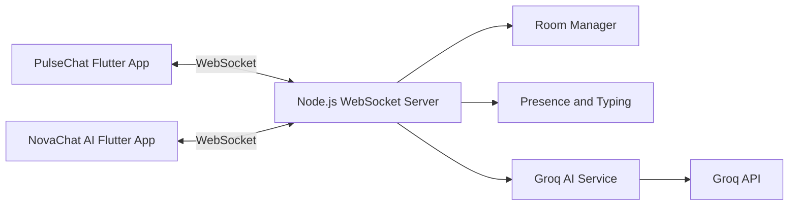

# Flutter Realtime Chat

PulseChat and NovaChat AI — two Flutter apps that share one Node.js WebSocket backend.

This project demonstrates Flutter development, Dart, WebSocket communication, real-time messaging, state management, Node.js backend integration, and Groq AI integration.

| App | Purpose |
|---|---|
| **PulseChat** (`chat_app_one`) | Human-to-human realtime chat |
| **NovaChat AI** (`chat_app_two`) | Same realtime chat + Groq-powered AI tools |
| **WebSocket Server** (`websocket_server`) | Shared rooms, presence, typing, AI proxy |

Both apps connect to the **same** backend and can chat in the same room instantly.

## Assignment objective

Build two sample Flutter chat apps over WebSocket — simple enough to verify core skills, polished enough for a live demo.

## Screenshots

> Add screenshots here after running the demo.

- `docs/screenshots/pulsechat-join.png`
- `docs/screenshots/pulsechat-chat.png`
- `docs/screenshots/novachat-chat.png`
- `docs/screenshots/novachat-ai-sheet.png`

## Architecture overview



## Folder structure

```text
flutter-realtime-chat/
├── chat_app_one/          # PulseChat
├── chat_app_two/          # NovaChat AI
├── websocket_server/      # Shared Node.js backend
├── README.md
└── .gitignore
```

Each Flutter app follows a clean, assignment-friendly layout:

```text
lib/
├── main.dart
├── app.dart
├── core/
├── models/
├── services/
├── providers/
├── screens/
└── widgets/
```

## Tech stack

**Flutter apps**

- Flutter + Dart (null safety)
- Material 3
- `provider`
- `web_socket_channel`
- `intl`
- `shared_preferences`
- `google_fonts`
- `uuid`

**Backend**

- Node.js + Express
- `ws`
- `cors`
- `dotenv`
- `uuid`
- Groq API (server-side only)

## WebSocket communication flow

1. Client connects to `ws://...:8080`
2. Client sends `join` with username + roomId
3. Server stores client in an in-memory room map
4. Server broadcasts system + presence events
5. Clients send `message` / `typing`
6. Server broadcasts to everyone in that room
7. NovaChat AI sends `ai_request`
8. Server calls Groq securely and returns `ai_response`
9. `/ai <question>` also broadcasts an AI chat message with `isAi: true`

## Message protocol

| Type | Direction | Purpose |
|---|---|---|
| `join` | client → server | Enter a room |
| `leave` | client → server | Leave current room |
| `message` | both | Chat message |
| `typing` | both | Typing start/stop |
| `presence` | server → clients | Online count |
| `system` | server → clients | Join/leave notices |
| `ai_request` | client → server | Ask backend AI |
| `ai_response` | server → client | AI result |
| `error` | server → client | Validation / AI errors |

Example chat message:

```json
{
  "type": "message",
  "id": "unique-message-id",
  "roomId": "general",
  "sender": "Manya",
  "content": "Hello!",
  "timestamp": "2026-07-04T10:30:00.000Z",
  "isAi": false
}
```

## How to run backend

```bash
cd websocket_server
cp .env.example .env
# Edit .env:
# GROQ_API_KEY=your_key
# GROQ_MODEL=llama-3.3-70b-versatile
npm install
npm start
```

Health check:

```bash
curl http://localhost:8080/health
```

Expected:

```json
{"status":"ok","service":"realtime-chat-server"}
```

## How to run App 1 (PulseChat)

```bash
cd chat_app_one
flutter create . --project-name chat_app_one
flutter pub get
flutter run
```

## How to run App 2 (NovaChat AI)

```bash
cd chat_app_two
flutter create . --project-name chat_app_two
flutter pub get
flutter run
```

> `flutter create .` only generates platform folders (`android/`, `ios/`, etc.) and keeps existing `lib/` code.

## Networking notes

| Target | WebSocket URL |
|---|---|
| iOS Simulator | `ws://127.0.0.1:8080` |
| Android Emulator | `ws://10.0.2.2:8080` |
| Physical device | `ws://YOUR_COMPUTER_LOCAL_IP:8080` |

Apps auto-select:

- Android emulator → `ws://10.0.2.2:8080`
- Everything else → `ws://127.0.0.1:8080`

Override anytime:

```bash
flutter run --dart-define=WS_URL=ws://192.168.1.10:8080
```

## Groq API configuration

Configure only in `websocket_server/.env`:

```env
PORT=8080
GROQ_API_KEY=your_groq_api_key_here
GROQ_MODEL=llama-3.3-70b-versatile
GROQ_TIMEOUT_MS=20000
```

- Never put the API key in Flutter source
- Never commit `.env`
- Change `GROQ_MODEL` to any currently supported Groq model

AI actions:

- `ask`
- `smart_reply`
- `rewrite_professional`
- `rewrite_friendly`
- `make_concise`
- `summarize`

## Demo steps

1. Start the Node.js server
2. Launch PulseChat
3. Enter username `Manya`
4. Join room `general`
5. Launch NovaChat AI
6. Enter username `Reviewer`
7. Join room `general`
8. Manya sends: `Hello from PulseChat!`
9. Reviewer receives it instantly
10. Reviewer starts typing
11. Manya sees `Reviewer is typing…`
12. Reviewer sends: `Hello from NovaChat AI!`
13. Manya receives it instantly
14. Reviewer uses **Rewrite Professionally**
15. Reviewer uses **Smart Reply**
16. Reviewer uses **Summarize Chat**
17. Reviewer sends: `/ai Explain why WebSocket is useful for chat`
18. AI response appears with an AI badge

## Features

- Shared realtime rooms over WebSocket
- Typing indicators
- Online participant count
- Connection lifecycle + reconnect with limited exponential backoff
- Duplicate message prevention via message IDs
- Provider-based state management
- Clean architecture in both apps
- Distinct premium UIs
- Groq AI tools in NovaChat AI only
- Input validation and basic rate limiting for AI

## Known limitations

- In-memory rooms only (no persistence)
- No authentication
- No message history after reconnect
- AI requires a valid Groq API key
- Single-server local demo (no horizontal scaling)

## Future improvements

- Persistent message history
- Read receipts
- Image attachments
- Push notifications
- Multi-room sidebar
- End-to-end encryption

## Testing checklist

- [ ] `GET /health` returns ok
- [ ] PulseChat joins `general`
- [ ] NovaChat AI joins `general`
- [ ] Messages appear instantly both ways
- [ ] Typing indicators work
- [ ] Online count updates on join/leave
- [ ] Reconnect banner appears if server restarts
- [ ] Smart replies return 3 chips
- [ ] Rewrite actions update composer text
- [ ] Summarize shows AI bottom-sheet result
- [ ] `/ai ...` returns an AI-badged message
- [ ] Invalid Groq key shows friendly AI error without crashing server

## Demo checklist

- [ ] Server running on port 8080
- [ ] Both apps open
- [ ] Different usernames
- [ ] Same room id
- [ ] Cross-app chat proven
- [ ] AI tools demonstrated from NovaChat AI

## Author

MANYA SHUKLA

2026
