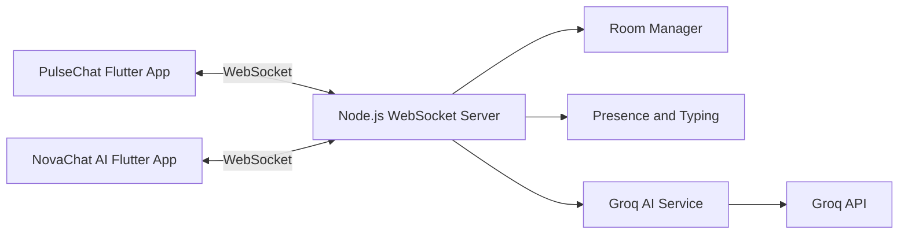

# Flutter Realtime Chat

Two Flutter chat apps that talk to each other through one shared Node.js WebSocket server.

## Assignment objective

Build a simple but complete realtime chat system in Flutter using WebSocket. The project shows:

- Flutter and Dart (null safety, Material 3)
- Realtime messaging over WebSocket
- Provider state management
- Connection lifecycle handling
- A small Node.js backend with rooms, presence, and typing
- Optional Groq AI features in the second app (API key stays on the server)

## Apps

### PulseChat (`chat_app_one`)

Human-to-human chat with a clean indigo/violet UI, light and dark themes, typing indicators, online count, and reconnect handling.

Browser title: `PulseChat | MS`

### NovaChat AI (`chat_app_two`)

Same realtime chat protocol as PulseChat, with a dark UI and Groq-powered tools:

- Smart Replies
- Rewrite Professionally / Friendly / Make Concise
- Summarize Chat
- `/ai <question>` command

Browser title: `NovaChat AI | MS`

Both apps use the MS monogram and the footer:

`by MANYA SHUKLA 2026`

### Shared WebSocket backend (`websocket_server`)

In-memory rooms, message broadcast, typing, presence, disconnect cleanup, and Groq AI requests over WebSocket.

## Features

- Join a room with a display name
- Send and receive messages in realtime
- Typing indicators
- Online participant count
- Connection status and limited reconnect with backoff
- Message IDs and duplicate prevention
- Room isolation
- Theme toggle in PulseChat
- Groq AI tools in NovaChat AI (server-side only)
- Configurable WebSocket URL for emulator, simulator, web, and physical devices

## Tech stack

**Flutter apps**

- Flutter / Dart (null safety)
- Material 3
- `provider`
- `web_socket_channel`
- `intl`
- `shared_preferences`
- `google_fonts`
- `uuid`

**Backend**

- Node.js
- Express
- `ws`
- `cors`
- `dotenv`
- Groq Chat Completions API (HTTP from the server only)

## Architecture



## Folder structure

```text
flutter-realtime-chat/
├── chat_app_one/          # PulseChat
├── chat_app_two/          # NovaChat AI
├── websocket_server/      # Shared backend
│   ├── src/
│   ├── .env.example
│   └── package.json
├── scripts/               # APK build helpers
│   ├── build_apk.sh
│   └── .env.example
├── README.md
└── .gitignore
```

## WebSocket flow

1. Client connects to `ws://…:8080`
2. Client sends `join` with `username` and `roomId`
3. Server stores the client in an in-memory room
4. Server broadcasts `system` and `presence` events
5. Clients send `message` and `typing`
6. Server broadcasts only to clients in that room
7. NovaChat AI can send `ai_request`
8. Server calls Groq and returns `ai_response` to the requester
9. `/ai <question>` broadcasts the user message, then one room message with `isAi: true`

## Message protocol

| Type | Direction | Purpose |
|---|---|---|
| `join` | client → server | Enter a room |
| `leave` | client → server | Leave the current room |
| `message` | both | Chat message |
| `typing` | both | Typing start/stop |
| `presence` | server → clients | Online count |
| `system` | server → clients | Join/leave notices |
| `ai_request` | client → server | Ask the backend for AI help |
| `ai_response` | server → client | Private AI result |
| `error` | server → client | Validation or AI errors |

Example chat message:

```json
{
  "type": "message",
  "id": "unique-id",
  "roomId": "general",
  "sender": "Manya",
  "content": "Hello",
  "timestamp": "2026-07-04T10:30:00.000Z"
}
```

Example AI request:

```json
{
  "type": "ai_request",
  "action": "ask",
  "roomId": "general",
  "username": "Reviewer",
  "content": "Explain WebSocket simply",
  "requestId": "unique-request-id"
}
```

Supported AI actions: `ask`, `smart_reply`, `rewrite_professional`, `rewrite_friendly`, `make_concise`, `summarize`.

## Groq AI flow

1. NovaChat AI sends `ai_request` over WebSocket
2. Backend validates input and applies per-client rate limits
3. Backend calls Groq with `GROQ_API_KEY` from `websocket_server/.env`
4. Backend returns `ai_response` only to the requesting client
5. For `/ai …`, the answer is sent as a room `message` with `isAi: true` (no private `ai_response`, so the UI does not show it twice)

The Flutter apps never receive or store the API key.

## Setup

### Backend

```bash
cd websocket_server
cp .env.example .env
# edit .env — set GROQ_API_KEY and GROQ_MODEL
npm install
npm start
```

Health check:

```bash
curl http://localhost:8080/health
```

Expected:

```json
{"status":"ok","service":"realtime-chat-server"}
```

Backend protocol audit (no Flutter required):

```bash
cd websocket_server
npm run audit
```

### PulseChat

```bash
cd chat_app_one
flutter create . --project-name chat_app_one
flutter pub get
flutter run
```

### NovaChat AI

```bash
cd chat_app_two
flutter create . --project-name chat_app_two
flutter pub get
flutter run
```

`flutter create .` generates platform folders (`android/`, `ios/`, etc.) and keeps the existing `lib/` code.

## Networking

| Target | WebSocket URL |
|---|---|
| Android Emulator | `ws://10.0.2.2:8080` |
| iOS Simulator | `ws://127.0.0.1:8080` |
| Flutter Web | `ws://localhost:8080` |
| Physical device | `ws://YOUR_COMPUTER_LOCAL_IP:8080` |

Defaults in code:

- Android emulator → `ws://10.0.2.2:8080`
- Flutter Web → `ws://localhost:8080`
- iOS simulator / desktop → `ws://127.0.0.1:8080`

Override:

```bash
flutter run --dart-define=WS_URL=ws://192.168.1.10:8080
```

For release APKs, use `scripts/.env` and `./scripts/build_apk.sh`.

## Environment configuration

### Backend (`websocket_server/.env`)

```bash
cp websocket_server/.env.example websocket_server/.env
```

```env
PORT=8080
GROQ_API_KEY=your_groq_api_key_here
GROQ_MODEL=your_supported_groq_model_here
GROQ_TIMEOUT_MS=20000
```

- `GROQ_API_KEY` — required for AI features; never commit this file
- `GROQ_MODEL` — any currently supported Groq model id
- Without a valid key, chat still works; AI requests return `AI_NOT_CONFIGURED`

### APK build (`scripts/.env`)

```bash
cp scripts/.env.example scripts/.env
```

```env
WS_URL=ws://192.168.1.10:8080
```

Use `10.0.2.2` only when the APK is meant for the Android emulator.

## Demo steps

1. Start the backend: `cd websocket_server && npm start`
2. Launch PulseChat
3. Username: `Manya`, room: `general`
4. Launch NovaChat AI
5. Username: `Reviewer`, room: `general`
6. Manya sends: `Hello from PulseChat!`
7. Reviewer receives it
8. Reviewer starts typing — Manya sees the typing indicator
9. Reviewer sends: `Hello from NovaChat AI!`
10. Manya receives it
11. In NovaChat AI, open the sparkle menu:
    - Smart Replies
    - Rewrite Professionally
    - Rewrite Friendly
    - Make Concise
    - Summarize Chat
12. Send: `/ai Explain why WebSocket is useful for chat`
13. Confirm the AI reply has an AI badge and “Generated by AI”

## Testing notes

Backend protocol checks that were run in development:

```bash
cd websocket_server
npm run audit
```

That script covers health, bidirectional chat, typing, presence, room isolation, malformed JSON, and AI error handling when no key is set.

Flutter `pub get`, `analyze`, and UI runs need a local Flutter SDK:

```bash
cd chat_app_one && flutter pub get && flutter analyze
cd ../chat_app_two && flutter pub get && flutter analyze
```

Live Groq success paths need a real `GROQ_API_KEY` in `websocket_server/.env`.

## Known limitations

- Rooms and messages are in-memory only (no database)
- No authentication
- Message history is not restored after reconnect
- AI features need a valid Groq API key
- Single local server (no multi-instance scaling)
- Platform folders (`android/`, `ios/`) are generated with `flutter create .` on first run

## Future improvements

- Persist message history
- Read receipts
- Image attachments
- Push notifications
- Multi-room sidebar
- End-to-end encryption

## Author

MANYA SHUKLA

2026
